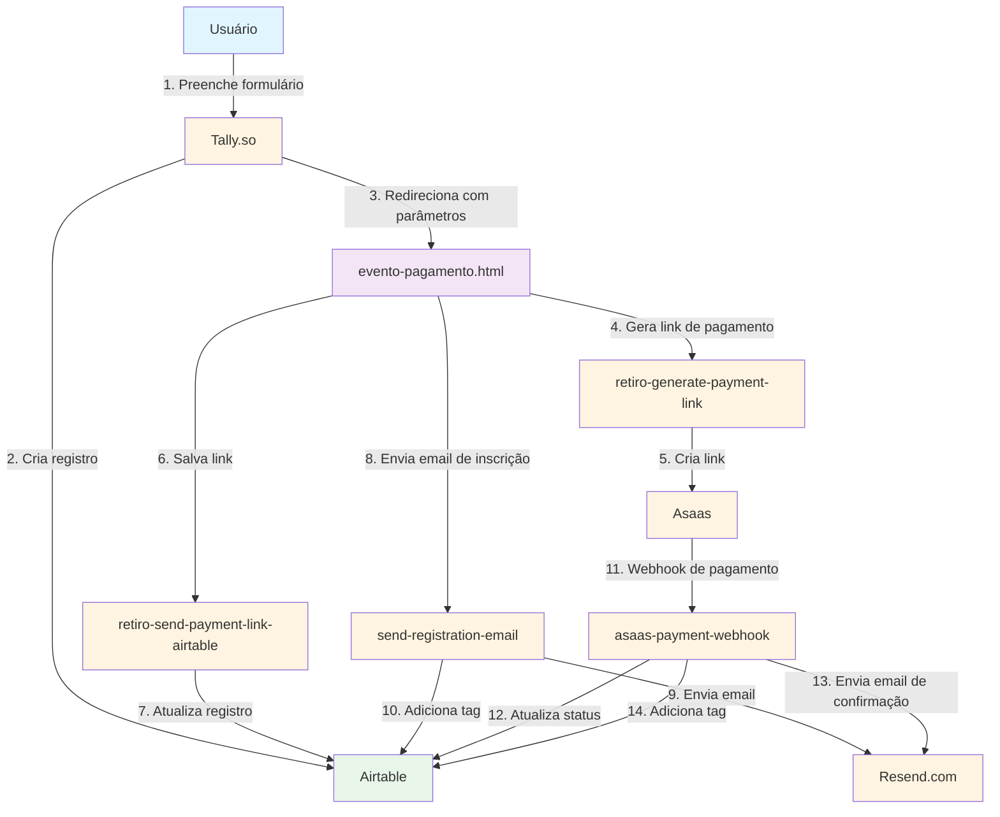
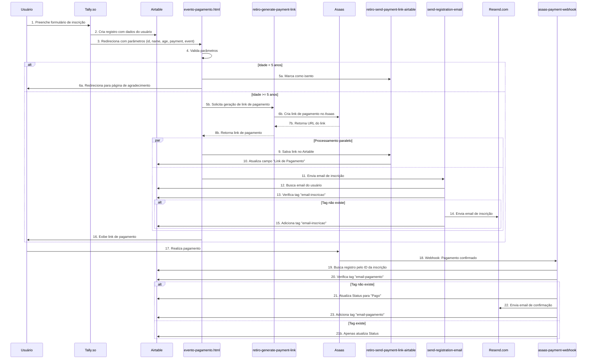
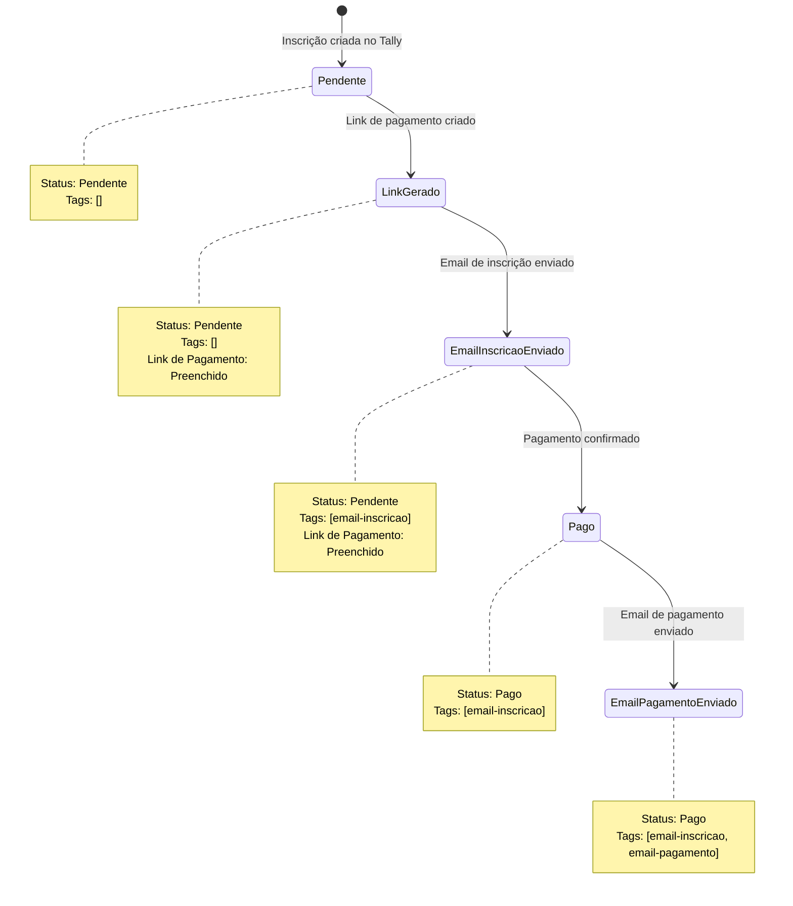
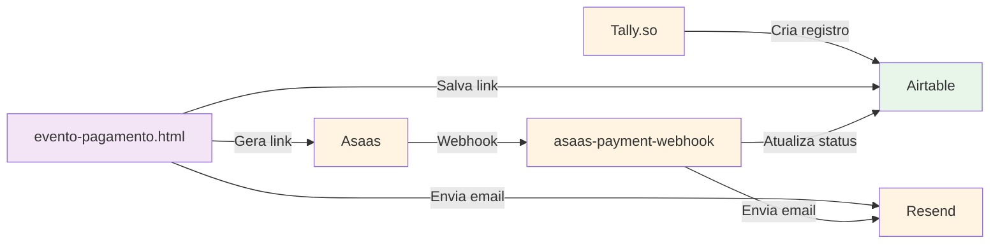

# Sistema de Inscrição e Pagamento de Eventos

## Visão Geral

Este documento descreve o sistema completo de inscrição e pagamento de eventos da Igreja Metodista Renovada. O sistema integra múltiplas plataformas para automatizar o processo desde a inscrição até a confirmação de pagamento.

## Arquitetura do Sistema



## Fluxo Completo de Inscrição e Pagamento



## Componentes do Sistema

### 1. Formulário de Inscrição (Tally.so)

**Arquivo:** `virada.html`

O formulário é criado no Tally.so e redireciona o usuário após a inscrição com os seguintes parâmetros:
- `id`: ID único da inscrição (ex: `ODKK4PM`)
- `name`: Nome do participante
- `age`: Idade do participante
- `payment`: Forma de pagamento (ex: `PIX - R$135,00`)
- `event`: Nome do evento

**URL de redirecionamento:**
```
https://www.metodistarenovada.com/evento-pagamento?id={id}&name={name}&age={age}&payment={payment}&event={event}
```

### 2. Página de Pagamento

**Arquivo:** `evento-pagamento.html`

Esta página processa a inscrição e gera o link de pagamento. O fluxo inclui:

1. **Validação de parâmetros**: Verifica se todos os parâmetros necessários estão presentes
2. **Verificação de idade**: 
   - Se idade < 5 anos: marca como isento e redireciona
   - Se idade >= 5 anos: gera link de pagamento
3. **Geração de link**: Chama a função `retiro-generate-payment-link`
4. **Salvamento no Airtable**: Chama `retiro-send-payment-link-airtable`
5. **Envio de email**: Chama `send-registration-email`

## Funções Netlify

### 1. retiro-generate-payment-link

**Arquivo:** `netlify/functions/retiro-generate-payment-link/retiro-generate-payment-link.js`

**Propósito:** Gera um link de pagamento no Asaas para a inscrição.

**Parâmetros:**
- `id`: ID da inscrição
- `name`: Nome do participante
- `age`: Idade do participante
- `payment`: Forma de pagamento
- `eventname`: Nome do evento

**Lógica de Valor:**
- Idade < 6 anos: R$ 0,00 (isento)
- Idade 6-10 anos: R$ 100,00
- Idade > 10 anos: R$ 135,00
- Cartão de crédito: + R$ 15,00 de taxa

**Tipo de Pagamento:**
- PIX: `billingType: "PIX"`
- Cartão de Crédito: `billingType: "CREDIT_CARD"` (até 3 parcelas)

**Formato do Nome no Asaas:**
```
Inscrição {eventname}: {name} ({id})
```

**Formato da Descrição no Asaas:**
```
Inscrição de {name} para {eventname} da Igreja Metodista Renovada ({id}). {extraMessage}
```

### 2. retiro-send-payment-link-airtable

**Arquivo:** `netlify/functions/retiro-send-payment-link-airtable/retiro-send-payment-link-airtable.js`

**Propósito:** Salva o link de pagamento no registro do Airtable.

**Parâmetros:**
- `id`: ID da inscrição
- `payment_link`: URL do link de pagamento do Asaas

**Fluxo:**
1. Aguarda 2 segundos (para garantir que o registro existe no Airtable)
2. Busca o registro usando `Id da Inscrição` (com retry até 5 tentativas)
3. Atualiza o campo `Link de Pagamento` com a URL

**Retry Logic:**
- Delay inicial: 2 segundos
- Máximo de tentativas: 5
- Delay entre tentativas: 1 segundo

### 3. send-registration-email

**Arquivo:** `netlify/functions/send-registration-email/send-registration-email.js`

**Propósito:** Envia email de confirmação de inscrição via Resend.

**Parâmetros:**
- `id`: ID da inscrição
- `name`: Nome do participante
- `event`: Nome do evento
- `payment_link`: URL do link de pagamento

**Fluxo:**
1. Aguarda 2 segundos (para garantir que o registro existe)
2. Busca o registro no Airtable
3. Verifica se a tag `email-inscricao` já existe
4. Se não existir:
   - Busca o email do usuário no registro
   - Envia email via Resend com:
     - Assunto: "Inscrição Realizada com Sucesso - {event}"
     - Conteúdo: Nome, evento e link de pagamento
   - Adiciona a tag `email-inscricao` ao registro
5. Se já existir: retorna sucesso sem enviar (evita duplicatas)

**Prevenção de Duplicatas:**
- Usa o campo `Tags` (Multiple Select) no Airtable
- Tag `email-inscricao` indica que o email já foi enviado
- Evita envio duplicado em caso de refresh da página

### 4. asaas-payment-webhook

**Arquivo:** `netlify/functions/asaas-payment-webhook/asaas-payment-webhook.js`

**Propósito:** Processa webhooks do Asaas quando um pagamento é confirmado.

**Eventos Processados:**
- `PAYMENT_RECEIVED`
- `PAYMENT_CONFIRMED`
- Status: `RECEIVED`, `CONFIRMED`, `RECEIVED_IN_CASH_OFFLINE`

**Fluxo:**
1. Recebe payload do webhook do Asaas
2. Extrai o ID da inscrição:
   - Primeiro tenta do campo `description`
   - Se não encontrar, tenta do campo `name`
   - Usa regex para extrair ID entre parênteses: `\(([A-Z0-9]+)\)`
3. Valida se o pagamento está confirmado
4. Busca o registro no Airtable
5. Verifica se a tag `email-pagamento` já existe
6. Se não existir:
   - Atualiza o campo `Status` para "Pago"
   - Busca email do usuário
   - Envia email de confirmação de pagamento via Resend
   - Adiciona a tag `email-pagamento`
7. Se já existir:
   - Apenas atualiza o Status (email já foi enviado)

**Prevenção de Duplicatas:**
- Usa a tag `email-pagamento` para evitar envio duplicado
- Atualiza status mesmo se o email falhar

## Integrações

### Airtable

**Base ID:** `app1w80Zv4Vo2FUdN`  
**Tabela:** `Inscritos`

**Campos Utilizados:**
- `Id da Inscrição`: ID único gerado pelo Tally.so (ex: `ODKK4PM`)
- `Nome`: Nome do participante
- `Email`: Email do participante
- `Status`: Status do pagamento (ex: "Pendente", "Pago")
- `Link de Pagamento`: URL do link de pagamento do Asaas
- `Tags`: Campo Multiple Select com tags:
  - `email-inscricao`: Indica que email de inscrição foi enviado
  - `email-pagamento`: Indica que email de pagamento foi enviado

**API:** Airtable REST API v0

### Asaas

**API:** Asaas API v3

**Endpoints Utilizados:**
- `POST /v3/paymentLinks`: Cria link de pagamento
- Webhook: Recebe notificações de pagamento

**Configuração do Webhook:**
- URL: `https://seu-dominio.netlify.app/.netlify/functions/asaas-payment-webhook`
- Eventos: `PAYMENT_RECEIVED`, `PAYMENT_CONFIRMED`

### Resend.com

**API:** Resend API

**Emails Enviados:**
1. **Email de Inscrição:**
   - Assunto: "Inscrição Realizada com Sucesso - {event}"
   - Conteúdo: Confirmação de inscrição com link de pagamento
   - Remetente: `contato@metodistarenovada.com`

2. **Email de Confirmação de Pagamento:**
   - Assunto: "Pagamento Confirmado - {event}"
   - Conteúdo: Confirmação de pagamento bem-sucedido
   - Remetente: `contato@metodistarenovada.com`

### Tally.so

**Formulário:** https://tally.so/r/w48DAr

**Configuração:**
- Após envio, redireciona para `evento-pagamento.html` com parâmetros
- Cria registro automático no Airtable via integração

## Diagrama de Estados do Registro



## Variáveis de Ambiente

As seguintes variáveis de ambiente devem estar configuradas no Netlify:

- `ASAAS_API_KEY`: Chave de API do Asaas
- `AIRTABLE_API_KEY`: Chave de API do Airtable
- `RESEND_API_KEY`: Chave de API do Resend

## Tratamento de Erros

### Retry Logic

As funções que interagem com o Airtable implementam retry logic para lidar com race conditions:

- **Delay inicial:** 2 segundos
- **Máximo de tentativas:** 5
- **Delay entre tentativas:** 1 segundo

Isso garante que o registro existe no Airtable antes de tentar atualizá-lo.

### Prevenção de Duplicatas

O sistema usa tags no Airtable para prevenir envio de emails duplicados:

- **Tag `email-inscricao`:** Previne envio duplicado do email de inscrição
- **Tag `email-pagamento`:** Previne envio duplicado do email de confirmação de pagamento

Mesmo que o usuário atualize a página ou o webhook seja chamado múltiplas vezes, os emails só serão enviados uma vez.

## Casos Especiais

### Crianças Isentas (Idade < 5 anos)

Quando a idade é menor que 5 anos:
1. Não gera link de pagamento
2. Marca como isento no Airtable
3. Redireciona diretamente para página de agradecimento

### Valores Promocionais

- **Idade 6-10 anos:** R$ 100,00 (valor promocional)
- **Idade > 10 anos:** R$ 135,00 (valor padrão)
- **Cartão de crédito:** + R$ 15,00 de taxa

## Fluxo de Dados



## Manutenção e Troubleshooting

### Verificar Logs

Os logs das funções Netlify podem ser acessados no dashboard do Netlify em:
- Functions → Logs

### Problemas Comuns

1. **Registro não encontrado no Airtable:**
   - Verificar se o delay inicial é suficiente
   - Verificar se o ID da inscrição está correto
   - Verificar se o campo `Id da Inscrição` existe no Airtable

2. **Email não enviado:**
   - Verificar se a tag já existe (prevenção de duplicatas)
   - Verificar se o email do usuário está preenchido no Airtable
   - Verificar logs do Resend

3. **Webhook não processado:**
   - Verificar se o webhook está configurado no Asaas
   - Verificar se a URL do webhook está correta
   - Verificar se o ID da inscrição está presente na descrição/nome do pagamento

## Melhorias Futuras

- [ ] Adicionar notificações de erro por email
- [ ] Implementar dashboard de monitoramento
- [ ] Adicionar suporte a múltiplos eventos
- [ ] Implementar sistema de fila para processamento assíncrono
- [ ] Adicionar métricas e analytics

